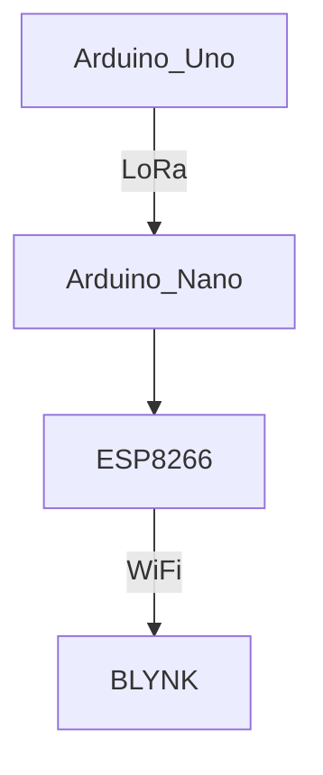

# IoT_Team2
Measure various environmental factors more preciously and use the Internet of Things (IoT) to transmit data, achieving real-time monitoring of plant growth.  Automatically control the whole greenhouse system to adjust the irrigation levels, light exposure, and temperature and humidity to optimize growth conditions.

Our Website URL: https://m11351015.wixsite.com/my-site-2/projects

# Team Member
- M11351015 Larry 李國楨
- M11251001 Cindy 張芊凡
- M11351010 Melody 陳玫寧
- M11351017 William 陳彥齊


# System Architecture
- **Central Controller**: Raspberry Pi 4 connected to a router, serving as the system's hub.
- **Sensors and Actuators**:
  - ESP8266 (Wemos D1 R2 board)
  - SG90 Servo Motor
  - LED Light Strip
  - OLED Display
  - 
  - Soil Condition Sensor
  - DHT Sensor(Temperature and Humidity Sensor)
  - PIR Motion Sensor
  - Water Pump
 

### Data Transmit

```mermaid
flowchart LR
  subgraph TOP
    direction TB
    subgraph Arduino_Board1
        direction LL
        Arduino_Uno --> LoRa_Uno
    end
    subgraph Arduino_Board2
        direction LL
        LoRa_Nano --> Arduino_Nano --> ESP8266
    end
  end
  Arduino_Board1-- Through LoRa --> Arduino_Board2

```


# Functions
The following charts shows the functions we aimed to put into our project at the beginning.

## Monitor
| Monitoring  | Specification | Finished |
| ------------- | ------------- | ------------- |
| Soil Humidity | Content Cell  |<ul><li>- [x] </li>
| Air Temperature & Humidity  | Content Cell  |<ul><li>- [x] </li>
| Motion Detection | Content Cell |<ul><li>- [x] </li>
| Camera Supervision| Content Cell |<ul><li>- [x] </li>
| Brightness | Photoresistor |<ul><li>- [x] </li>

## Actuation
| Actuation | Specification | Finished |
| ------------- | ------------- | ------------- |
| Soil Humidity | Content Cell  |<ul><li>- [x] </li>
| Air Temperature & Humidity  | Content Cell  |<ul><li>- [x] </li>
| Motion Detection | Content Cell |<ul><li>- [x] </li>

## Communication
| Monitoring  | Specification | Finished |
| ------------- | ------------- | ------------- |
| LoRa | Content Cell  |<ul><li>- [x] </li>
|  | Content Cell  |<ul><li>- [x] </li>

## Power
| Monitoring  | Specification | Finished |
| ------------- | ------------- | ------------- |
| Soil Humidity | Content Cell  |<ul><li>- [x] </li>
| Air Temperature & Humidity  | Content Cell  |<ul><li>- [x] </li>


通訊
感測
功能
能源
資料收集


# 接線圖
## Overall Wiring diagram


## PIR Motion Sensor


## Photoresistor


## ESP8266


## Soil Humidity & temperature Sensor


## DHT sensor


  
