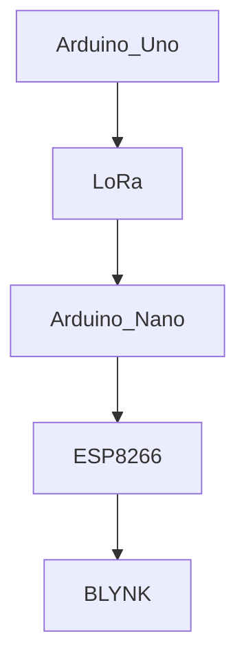

# IoT_Team2
Measure various environmental factors more preciously and use the Internet of Things (IoT) to transmit data, achieving real-time monitoring of plant growth.  Automatically control the whole greenhouse system to adjust the irrigation levels, light exposure, and temperature and humidity to optimize growth conditions.

# Team Member
- M11351015 Larry 李國楨
- M11251001 Cindy 張芊凡
- M11351010 Melody 陳玫寧
- M11351017 William 陳彥齊

# System Architecture
- **Central Controller**: Raspberry Pi 4 connected to a router, serving as the system's hub.
- **Sensors and Actuators**:
  - ESP8266 (Wemos D1 R2 board)
  - SG90 Servo Motor
  - LED Light Strip
  - OLED Display
  - 
  - Soil Condition Sensor
  - DHT Sensor(Temperature and Humidity Sensor)
  - PIR Motion Sensor
  - Water Pump
 

# Function
| Monitoring  | Specification |
| ------------- | ------------- |
| Soil Humidity | Content Cell  |
| Air Temperature & Humidity  | Content Cell  |
| Motion Detection | Content Cell |
| Camera Supervision| Content Cell |
| Brightness | Photoresistor |

通訊
感測
功能
能源
資料收集
Website

#
| Task           | Time required | Assigned to   | Current Status | Finished | 
|----------------|---------------|---------------|----------------|-----------|
| Calendar Cache | > 5 hours  |  | in progress | - [x] ok?
| Object Cache   | > 5 hours  |  | in progress | [x] item1 [ ] item2
| Object Cache   | > 5 hours  |  | in progress | <ul><li>- [x] item1</li><li>- [ ] item2</li></ul>
| Object Cache   | > 5 hours  |  | in progress | <ul><li>[x] item1</li><li>[ ] item2</li></ul>

- [x] works
- [x] works too

# 接線圖
  
