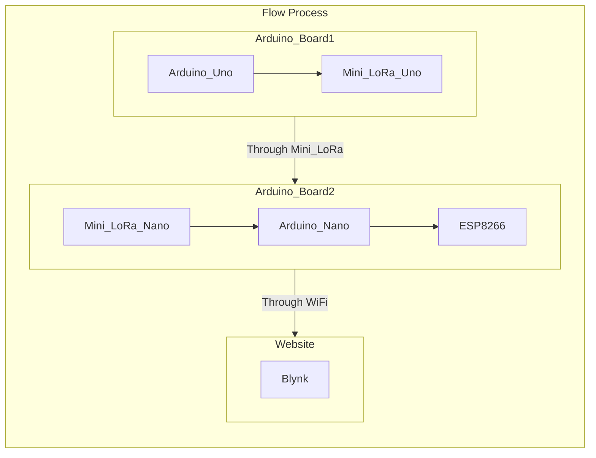
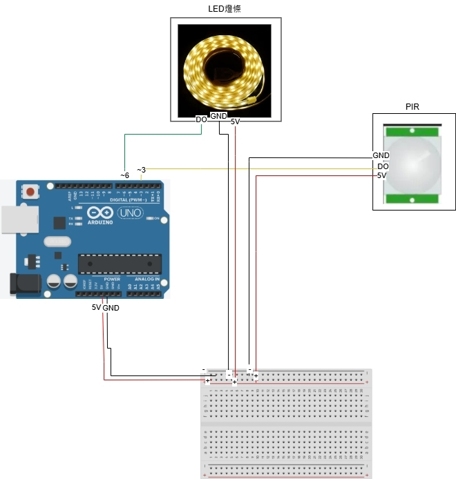
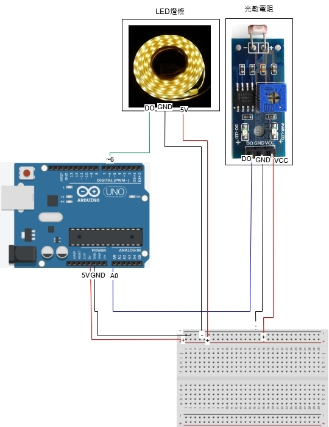
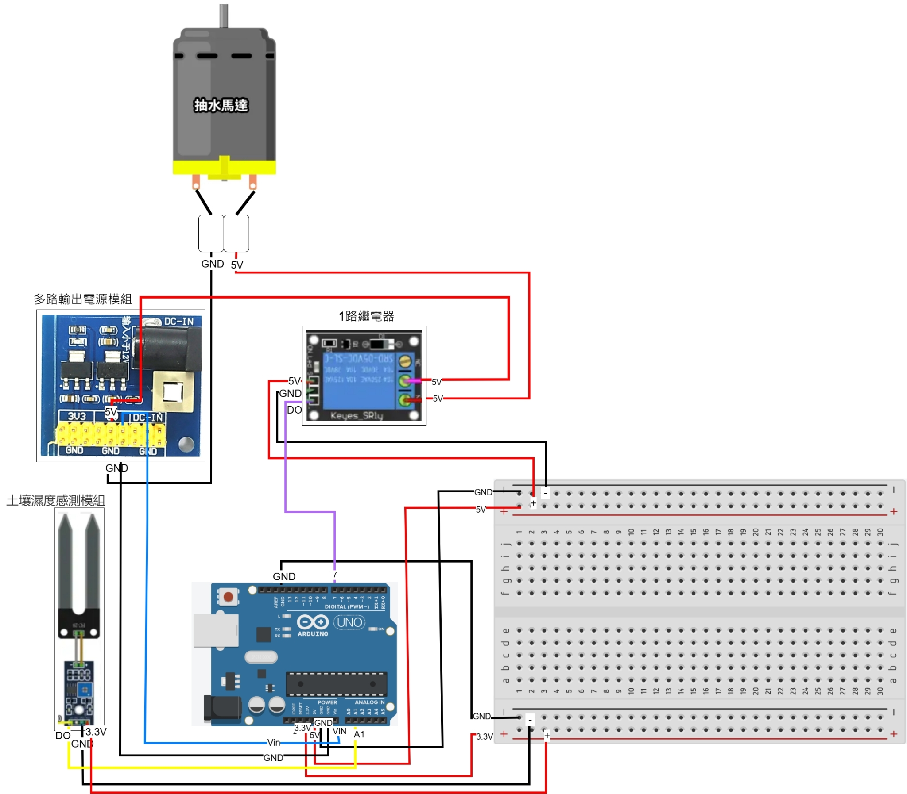
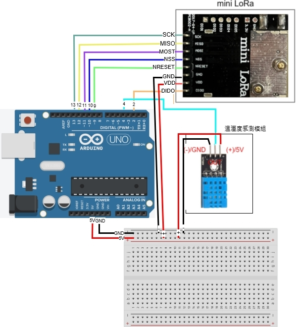

# 2024 IIoT_Smart Micro-Greenhouse
Measure various environmental data more preciously and use the Internet of Things (IoT) to transmit data, achieving real-time monitoring of plant growth. Automatically control the whole greenhouse system to adjust the irrigation levels, light exposure, and temperature and humidity to optimize growth conditions.

Our Website URL: https://m11351015.wixsite.com/my-site-2/projects

# Team Member (Job Allocation)
- M11351015 Larry 李國楨 (Software,Website)
- M11251001 Cindy 張芊凡 (Software,PPT,Onenote)
- M11351010 Melody 陳玫寧 (Hardware,Onenote)
- M11351017 William 陳彥齊 (Hardware,GitHub)

# System Architecture
## Main Components:

- **Central Controller**:
  - Arduino UNO Board
  - Arduino Nano Board
    
- **Sensors and Actuators**:
  - LED Light Strip
  - OLED Display
  - Photoresistor
  - Soil Humidity Sensor
  - DHT Sensor(Air Temperature and Humidity)
  - PIR Motion Sensor
  - Water Pump

- **Communication**
  - ESP8266 (Wemos D1 R2 board)
  - Mini LoRa * 2 (With Antenna) 
 

### Data Transmit

# Functions
The following charts shows the functions we aimed to put into our project at the beginning.

### Monitor
| Components | Functions | Finished |
| ------------- | ------------- | ------------- |
| Soil Humidity Sensor | Collecting Soil Humidity Data |<ul><li>- [x] </li>
| DHT Sensor | Collecting Air Temperature & Humidity Data |<ul><li>- [x] </li>
| PIR Sensor | Motion Detection |<ul><li>- [x] </li>
| Photoresistor | Measuring Brightness Change |<ul><li>- [x] </li>
| Camera | Real-time Monitoring |<ul><li>- [ ] </li>

### Actuation
| Components | Functions | Finished |
| ------------- | ------------- | ------------- |
| Water Pump | Self Watering System |<ul><li>- [x] </li>
| LED Light Strip | Sensor Light & Control Sunshine Duriation |<ul><li>- [x] </li>
| OLED Display | Show Real-Time Data From Sensors |<ul><li>- [x] </li>
| Fan | Control Air Temperature & Humidity |<ul><li>- [ ] </li>
| Sunshade | Control Sunshine Duriation |<ul><li>- [ ] </li>

### Communication
| Components | Functions | Finished |
| ------------- | ------------- | ------------- |
| LoRa | Transfer Data Between Device |<ul><li>- [x] </li>
| WiFi | Transfer Data From Device To Blynk  |<ul><li>- [x] </li>

### Power
| Components | Functions | Finished |
| ------------- | ------------- | ------------- |
| Rechargeable Batteries | Power Storage |<ul><li>- [ ] </li>
| Small Solar Panel | Power Supply |<ul><li>- [ ] </li>

### Data Platform
| Platform | Functions | Finished |
| ------------- | ------------- | ------------- |
| Blynk | Data Collection & Presention & Visualization  |<ul><li>- [x] </li>

# Wiring Diagram
## Overall Diagram

## PIR Motion Sensor

## Photoresistor

## Soil Humidity & temperature Sensor

## DHT sensor

## ESP8266

# Software
- Arduino IDE : https://www.arduino.cc/en/software (Sign In & Download)
- BLYNK : https://blynk.io/
- CH340 : https://sparks.gogo.co.nz/ch340.html?srsltid=AfmBOoo-oroGvox_G-0aVYyVQEFKZspoib5eJGVV9Epufqb9xcQvNUEe (If necessary)

# Arduino Library

| Library | Used for | Library | Used for |
| ------------- | ------------- | ------------- | ------------- |
| FastLED.h | 控制 LED 燈條 | DHT.h | 控制 DHT 溫濕度感測器 |
| BH1750.h | 控制光照度感測器 | Adafruit_Sensor.h | Adafruit 感測器庫 |
| Adafruit_GFX.h | OLED 顯示圖形支援 | Adafruit_SH1106.h | 控制 SH1106 OLED 顯示器 |
| LoRa.h | LoRa 通訊功能 | SPI.h | LoRa 通訊依賴的 SPI 介面 |
| Wire.h | I2C 通訊支援 | ESP8266WiFi.h | 控制 ESP8266 Wi-Fi 功能 |
| BlynkSimpleEsp8266.h | 支援 Blynk 遠端控制功能 |

- **FastLED.h** – Control LED strip.
- **DHT.h** – Control DHT temperature and humidity sensor.
- **BH1750.h** – Control light intensity sensor.
- **Adafruit_Sensor.h** – Adafruit sensor library.
- **Adafruit_GFX.h** – Support for OLED display graphics.
- **Adafruit_SH1106.h** – Control SH1106 OLED display.
- **LoRa.h** – LoRa communication functionality.
- **SPI.h** – SPI interface required for LoRa communication.
- **Wire.h** – Support for I2C communication.
- **ESP8266WiFi.h** – Control ESP8266 Wi-Fi functionality.
- **BlynkSimpleEsp8266.h** – Support for Blynk remote control functionality.

# Future Work or next goal

  
